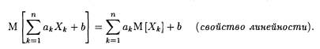
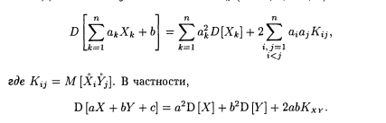

# Билет №2.6. Математическое ожидание функции от случайной величины.

Если X - дискретная или непрерываня случайная величина с известным законом распределения и  $Y=\phi(X) $, где  $\phi $ - неслучайная функция, то математическое ожидание случайной величины  $Y $ в случае, если оно существует, может быть найдена по формуле: 

$$ M\phi(X) = \displaystyle\int\limits_{-\infty}^\infty \phi(x)f_X(x)dx $$

## Cвойства

1. Для любых случайных величин  $X_k $ (k = 1,2,...,n)

  

2. Если  $X>=0 $, то  $M[X]>=0 $.  
3. Если  $X>=0 $ и  $M[X]=0 $, то  $P{X=0}=1 $.  
4. Для любых случайных величин  $X_k $ (k = 1,2,...,n)

  

5. $M[XY] = M[X]M[Y] + K_{xy} $  
6. $M^2[XY] <= M[X^2]M[Y^2]$ (неравенство Коши-Буняковского).  
7. Если  $X $ и  $Y $ независимы, то  
 $$ D[XY] = D[X]D[Y] + m^2_xD[Y] + m^2_yD[X]$$

## Создатель

Автор расписанного билета: Топчий Женя и Смирнов Костя

Кто проверил:
-
