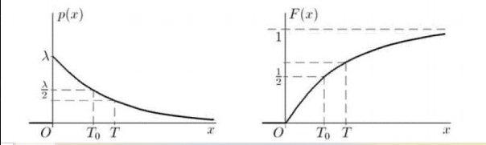

# Билет №3.2. Показательное распределение.

Случайная величина подчиняется экспоненциальному (показательному) закону, если она имеет плотность
распределения:

$$ p(x) =
\begin{cases}
0, \text{ если }  x < 0,\\
\lambda e^{-\lambda x} \text{ если } x >= 0
\end{cases}
$$

где  $\lambda $  - параметр экспоненциального распределения. Для функции распределения в данном случае нетруднно получить следующее выражение:

$$ F(x) =
\begin{cases}
0, \text{ если }  x < 0,\\
1 - e^{-\lambda x} \text{ если } x >= 0
\end{cases}
$$

Графики плотности расрпеделения и функции распределения экспоненциальной случайной величины:  

## Создатель

Автор расписанного билета: Топчий Женя и Смирнов Костя

Кто проверил:
- 
